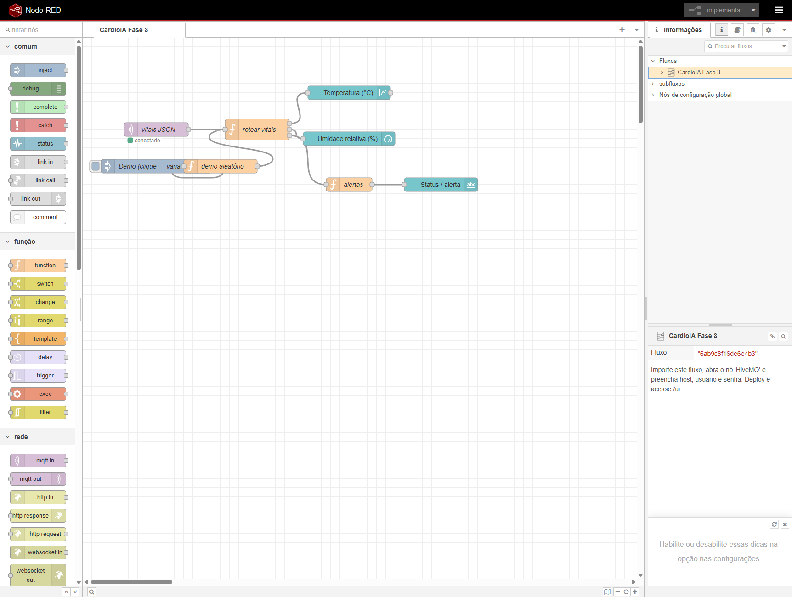
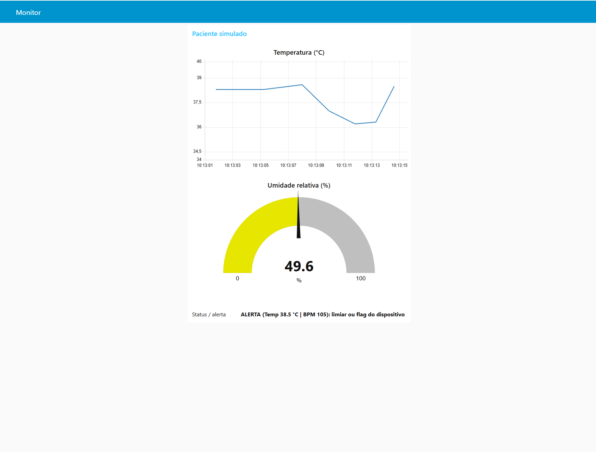

# CardioIA — Fase 3: IoT, Edge e dashboards

Terceira fase do projeto: **monitoramento simulado** com ESP32 (Wokwi), **resiliência offline** na borda, **MQTT** (nuvem) e **dashboard** no Node-RED.

**Autor:** Gustavo Zanette Martins  
**RM:** 564523

---

## Estrutura

```
fase3/
├── README.md                 
├── firmware/
│   └── cardioia_fase3/
│       ├── cardioia_fase3.ino
│       └── secrets.h.example 
├── wokwi/
│   ├── diagram.json          
│   └── wokwi.toml
├── node-red/
│   └── flows.json            # Fluxo + dashboard
└── docs/
    ├── relatorio_parte1_edge.md
    ├── relatorio_parte2_mqtt_dashboard.md
    └── imagens/
        └── README.md       
```

---

## Pré-requisitos

1. Conta no [Wokwi](https://wokwi.com/) (simulação ESP32).
2. Cluster gratuito no [HiveMQ Cloud](https://www.hivemq.com/mqtt-cloud-broker/) (MQTT TLS).
3. [Node-RED](https://nodered.org/) local — instalação de `node-red-dashboard` e importação do fluxo na seção **Node-RED** abaixo.

---

## Projeto Wokwi (link público)

- **Link Wokwi:** [https://wokwi.com/projects/463738092570346497](https://wokwi.com/projects/463738092570346497)

Republicação ou duplicação no Wokwi: no simulador, **Save** / **Share**; se o URL público mudar, atualizar a linha do link neste README.

Para criar outro projeto no Wokwi Web, importar os arquivos de `wokwi/` e `firmware/` (ESP32, DHT22 e botões conforme `diagram.json`).

---

## Firmware (Arduino / ESP32)

### Compilar localmente (PlatformIO; não depende dos servidores de build do Wokwi)

O arquivo `platformio.ini` está em `fase3/firmware/`. Passos:

1. Instalar a extensão **PlatformIO IDE** no VS Code/Cursor.
2. `File → Open Folder` → pasta `fase3/firmware/`.
3. Na barra inferior do VS Code, ícone **✓ Build** do PlatformIO (ou `pio run` no terminal).
4. Saída esperada: `fase3/firmware/.pio/build/esp32dev/firmware.elf` e `firmware.bin`.

Como alternativa, pelo terminal:

```bash
pip install platformio
cd fase3/firmware
pio run
```

### Simular localmente no VS Code/Cursor

1. Instalar a extensão **Wokwi for VS Code**.
2. Ativar a licença com **`Wokwi: Request a new License`** (gratuita; abre o navegador). O **CI token** do Wokwi destina-se ao `wokwi-cli` na linha de comando, não a este fluxo no IDE.
3. **Projeto Wokwi só em `fase3/wokwi/`:** `diagram.json` e `wokwi.toml` na mesma pasta (firmware referenciado: `../firmware/.pio/build/esp32dev/...`).
   - **Opção A (recomendada):** `File → Open Folder` → **`fase3/wokwi`** → abrir `diagram.json` → paleta → **Wokwi: Start Simulator**.
   - **Opção B:** com o repositório `cardioia/` aberto, abrir **`fase3/wokwi/diagram.json`** e iniciar o simulador (a extensão usa o `wokwi.toml` dessa pasta).
4. Compilar antes em `fase3/firmware` (o `wokwi.toml` aponta para o `.bin` gerado pelo PlatformIO).
5. Paleta (`Ctrl+Shift+P`) → **Wokwi: Start Simulator**. Manter a aba do simulador **visível** (a simulação pode pausar em segundo plano).
6. **Serial:** painel integrado do Wokwi no VS Code/Cursor. Em `diagram.json`, `serialMonitor.display = always` abre o painel quando houver saída do firmware.
7. Recompilar (`python -m platformio run` em `fase3/firmware`) após alterações no `.ino`.

### Bibliotecas

As dependências constam do `platformio.ini` e são obtidas pelo PlatformIO na compilação. Para Arduino IDE ou Wokwi Web, instalar manualmente:

- **DHT sensor library** (Adafruit)  
- **Adafruit Unified Sensor** (dependência do DHT)  
- **PubSubClient** (Nick O’Leary)  
- **ArduinoJson** (Benoît Blanchon) v6+

### Credenciais

```text
Copiar fase3/firmware/cardioia_fase3/secrets.h.example para secrets.h
Preencher WIFI_* e MQTT_* para MQTT com broker real (HiveMQ).
```

Com **SSID vazio** (sem `secrets.h` ou sem rede configurada), o firmware usa **Wi-Fi simulada**: o estado “online” alterna com o **botão Wi-Fi** no diagrama. **MQTT** com broker real exige Wi-Fi e credenciais MQTT em `secrets.h`.

### Comportamento resumido

- **DHT22** (obrigatório): temperatura e umidade (1 sensor).
- **Botão “pulso”**: incrementa pressões no minuto → **BPM** simulado.
- **Botão Wi-Fi** (só em modo simulado): alterna conexão para testar fila offline.
- **Fila em RAM** (FIFO, tamanho máximo configurável): amostras enfileiradas offline; em estado “online”, esvaziamento da fila por **MQTT publish** com `secrets.h` preenchido, ou por **`Serial.println`** no modo simulado (prefixos `SIM CLOUD FLUSH` / `SIM PUBLISH …`).
- **SPIFFS**: desativado por omissão (`USE_SPIFFS 0`). Em ESP32 físico, pode-se ativar persistência em `/vitals.csv`; o arquivo é removido após flush bem-sucedido.
- **Serial**: logs `ENQUEUE`, `FLUSH fila vazia`, `DROP oldest`, `SIM PUBLISH …` e `MQTT PUBLISH ok/falhou` para evidência no simulador.

### Tópicos MQTT

- Publicação: `cardioia/esp32_01/vitals`  
- Payload JSON: `ts`, `temp`, `hum`, `bpm`, `alert` (0/1), `backlog`.

`DEVICE_ID` e `MQTT_TOPIC_BASE` no `.ino` são configuráveis conforme o ambiente.

---

## Node-RED

### Instalação

```bash
npm install -g node-red
cd ~/.node-red   # Windows: pasta de dados do Node-RED (ex.: %UserProfile%\.node-red)
npm install node-red-dashboard
```

Iniciar o Node-RED e abrir o editor (por omissão `http://127.0.0.1:1880`). Os nós MQTT usados no fluxo constam da paleta padrão.

### Importar fluxo e broker

1. Menu **Importar** → [`node-red/flows.json`](node-red/flows.json).
2. No nó de configuração **HiveMQ** (broker MQTT):
   - **Server:** hostname do cluster (ex.: `xxxx.s1.eu.hivemq.cloud`), sem prefixo `mqtts://`
   - **Port:** `8883`
   - **TLS:** habilitado
   - **Username** e **Password** da aba **Access Management** do HiveMQ Cloud (credenciais do cluster, não o login do site)
3. **Deploy**.
4. Dashboard: `http://127.0.0.1:1880/ui` (ajustar a porta se o Node-RED estiver em outra).

Limiares no dashboard: nós **function** “Alertas” (omissão: temperatura > 38 °C, BPM > 120).

### Teste sem broker MQTT

Nó **inject** “Demo (clique — varia valores)” ligado à função **demo aleatório**: a cada disparo gera temperatura, umidade e BPM variados para validar gráfico e gauge sem depender do ESP32.

### Evidências

Dashboard em `/ui` (gráfico de temperatura, gauge de umidade):



Indicador de alerta (limiares / flag do dispositivo):



Arquivos PNG em [`docs/imagens/`](docs/imagens/).

### Erro `Connection failed to broker`

- Confirmar usuário e senha do **cluster** (HiveMQ → **Access Management**).
- Hostname só com o nome do servidor; porta **8883**; **TLS** ativo; saída **TCP 8883** na rede/firewall.
- Persistindo falha: validar o fluxo com o inject de demonstração acima e revisar credenciais.

### Erros `ui_base` / `ui_gauge` (ex.: `reading 'value'`)

1. **`allowTempTheme: "none"`** no `ui_base` — em algumas versões do `node-red-dashboard` exige tema completo. O `flows.json` usa **`allowTempTheme: "true"`** e `angularTheme.palette: "light"`.
2. **Gauge com `seg1` / `seg2` vazios** — pode produzir `NaN`; no fluxo atual usam-se `33` e `66`.
3. **Fluxo duplicado** — remover abas antigas de teste, importar de novo o `flows.json` e **Deploy** (evita dois `ui_base` ou widgets órfãos).

Procedimento: importar de novo [`node-red/flows.json`](node-red/flows.json), **Deploy**; se persistir, reiniciar o processo Node-RED.

---

## Relatórios

- [docs/relatorio_parte1_edge.md](docs/relatorio_parte1_edge.md) — Parte 1 (edge, fila, SPIFFS/Serial).
- [docs/relatorio_parte2_mqtt_dashboard.md](docs/relatorio_parte2_mqtt_dashboard.md) — Parte 2 (MQTT, Node-RED).

---

## Repositório geral

Ver [README.md](../README.md) na raiz do projeto CardioIA.
